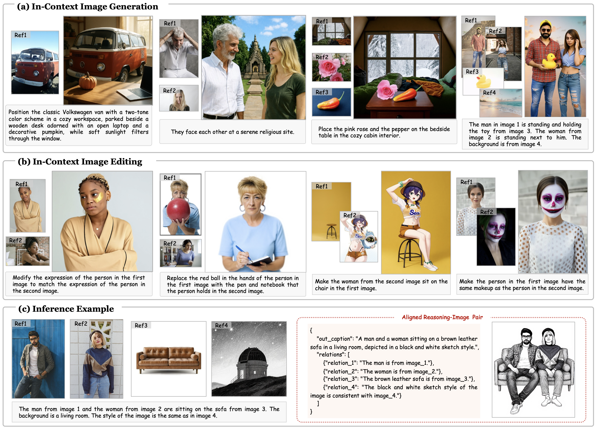

# Re-Align: Structured Reasoning-guided Alignment for In-Context Image Generation and Editing

> ## Re-Align: Structured Reasoning-guided Alignment for In-Context Image Generation and Editing
>
> Runze He1,2,3, Yiji Cheng1, Tiankai Hang1, Zhimin Li1, Yu Xu1, Zijin Yin1, Shiyi Zhang1, Wenxun Dai1, Penghui Du3, Ao Ma3, Chunyu Wang1,✝, Qinglin Lu1, Jizhong Han2,3, Jiao Dai2,3,‡
> 
> 1Hunyuan, Tencent, 2IIE, CAS, 3UCAS

> **In-context image generation and editing** (ICGE) enables users to specify visual concepts through interleaved image-text prompts, demanding precise understanding and faithful execution of user intent. Although recent unified multimodal models exhibit promising understanding capabilities, these strengths often fail to transfer effectively to image generation. We introduce Re-Align, a unified framework that bridges the gap between understanding and generation through structured reasoning-guided alignment. At its core lies the **In-Context Chain-of-Thought** (IC-CoT), a structured reasoning paradigm that decouples semantic guidance and reference association, providing clear textual target and mitigating confusion among reference images. Furthermore, Re-Align introduces an effective RL training scheme that leverages a surrogate reward to measure the alignment between structured reasoning text and the generated image, thereby improving the model’s overall performance on ICGE tasks. Extensive experiments verify that Re-Align outperforms competitive methods of comparable model scale and resources on both in-context image generation and editing tasks.
